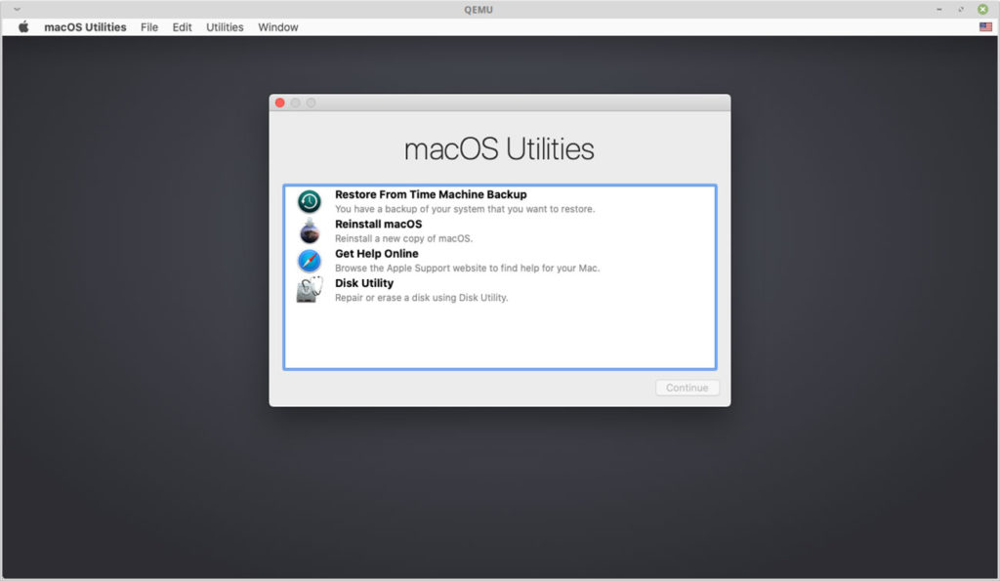
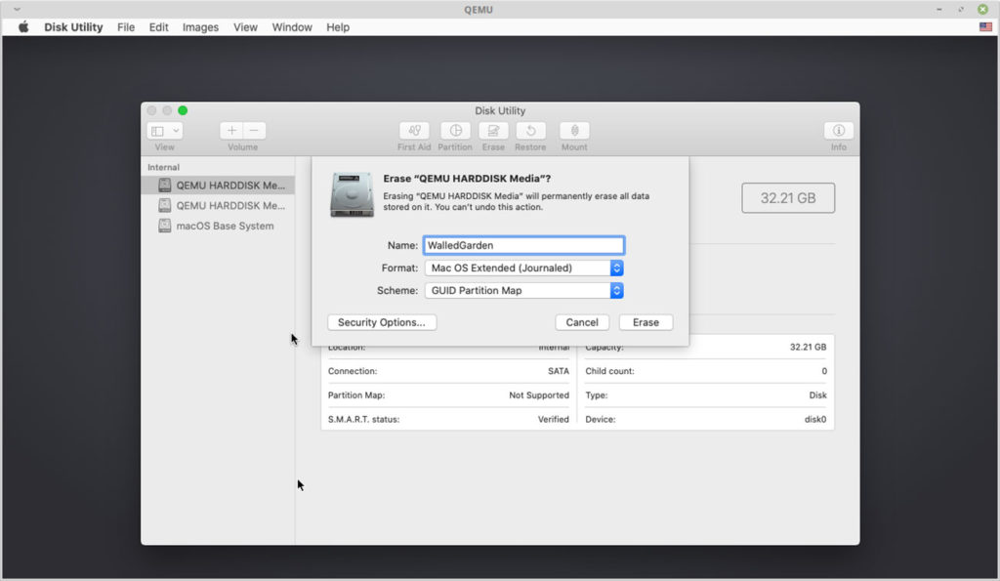
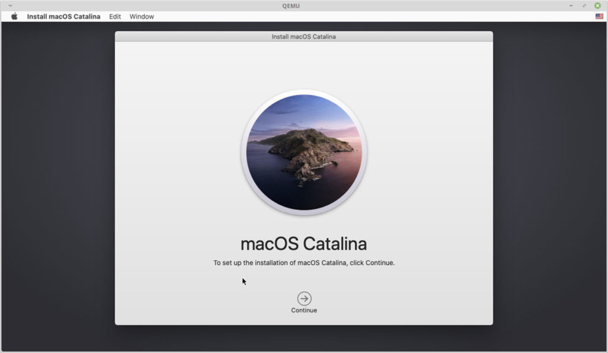

<h1 align="center"> 
  Vm macOs usando QEMU
</h1>

## Info

Tutorial de comandos de como criar uma vm do mac totalmente funcional podendo instalar o xcode, homebrew, emulador do iphone.Para fazer a instalação você precisa ter uma conexão de internet estável qualquer oscilação no ping vai interromper a instalação.

## Instalação 

1. Primeiro instale as dependências do python para o seu linux.

- Para Ubuntu, Debian, Mint, and PopOS => `sudo apt-get install qemu-system qemu-utils python3 python3-pip`
- Para Arch, Manjaro => `sudo pacman -S qemu python python-pip `
- Para Void linux => `sudo xbps-install -Su qemu python3 python3-pip`
- Para OpenSuse => `sudo zypper in qemu-tools qemu-kvm qemu-x86 qemu-audio-pa python3-pip`
- Para Fedora => `sudo dnf install qemu qemu-img python3 python3-pip`

2. Clone o projeto e entre na pasta dele, `git clone https://github.com/foxlet/macOS-Simple-KVM.git && cd ./macOS-Simple-KVM`

3. Baixa a iso oficial do site da apple com o comando a baixo.

- Catalina `./jumpstart.sh --catalina` ou `./jumpstart.sh`
- Mojave `./jumpstart.sh --mojave`
- High Sierra `./jumpstart.sh --high-sierra`

4. Agora vamos criar um disco vazio com o comando `qemu-img create -f qcow2 MyDisk.qcow2 64G`

5. Vamos editar o arquivo `basic.sh` para mostrar para ele que agora existe um disco novo `sudo nano basic.sh` copie para dentro essas linhas

- `-drive id=SystemDisk,if=none,file=MyDisk.qcow2 \`
- `-device ide-hd,bus=sata.4,drive=SystemDisk \`

6. Agora é só execultar `sudo ./basic.sh`.

7. Entre no utilitario de disco.
   
<h1 align="center">
  
</h1>

8. Nessa ferramenta vc vai escolher o disco que foi criado na linha de comando, no meu caso de 32 gigas e se vc seguiu o tutorial a risca o seu vai ser de 64 gigas.

<h1 align="center">
  
</h1>

9. A partir de agora é a instalação normal do mac.

<h1 align="center">
  
</h1>
